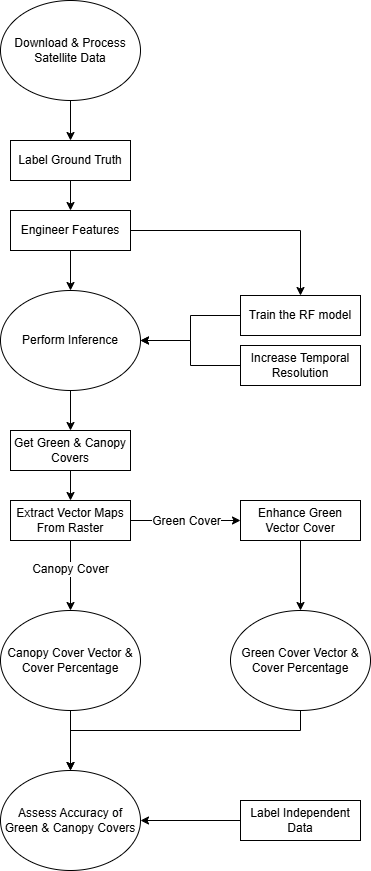

# Production-ready Pipeline for Green Cover Classification

<center>
  <figure>
    
  </figure>
</center>

## Summary

This repository contains interactive notebooks that guide you through the process of creating a green & canopy cover map from free satellite data using machine learning. The project is a democratisation of the Greater London Authority's 2024 methodology, designed with freely available data and runnable on consumer-grade hardware. The notebooks adapt the method by providing thorough explanations and simple code interaction, serving as both an educational resource and a production-ready pipeline. The project may be used by independent users and NGOs that require custom vegetation maps for environmental applications, such as tracking carbon sequestration or monitoring the heat island effect. 

## Project Outputs

The project concludes with a method evaluation based on accuracy results from a demo conducted in the City of Westminster. The method produced a green and canopy cover map with 92% overall accuracy, and a cover much more comprehensive than those produced from similar resolution satellite imagery.

## How to Use
The file system and code cells are constructed such that the project simply works as long as the correct file types are placed within the correct folders when instructed. The user must occasionally switch to their preferred GIS software when mentioned.

Preset files are provided for the City of Westminster demo project at every step of the process for ease of implementation and experimentation. The scientific process of the ML classification is explained, with tips and anecdotes on applying the method. Tutorials are linked, and calculations are manually displayed. The full process is open to reader verification and scrutiny.

* **Note:** The sections that explain the workflow applied to the City of Westminster are separated by two lines, above and below the section.

## Methodology Adaptation

The project's method is based on the Greater London Authority (GLA) 2024 Green mapping method, in which the GLA details the process of converting commercial satellite data into green and canopy vector maps. The process was adapted for the lower resolution of free satellite data and expanded with additional insights and features, such as signal enhancement and error visualisations. Code was written from the ground up, since none was provided in the original report. The GLA 2024 report is frequently cited throughout for ease of reference.

## Overall Process

<center>
  <figure>
    
    <figcaption><i>Process Flowchart</i></figcaption>
  </figure>
</center>

## Prerequisite Knowledge

While the notebooks provide overviews of essential topics and links to outside resources, it is recommended that the user understands the basics of machine learning (particularly Random Forests) and geospatial data handling (rasters and vectors). 

The user must also have access to a GIS software, such as QGIS, and be familiar with the basics of GIS Processing Functions.

<br>

* **Note:** for those reading the notebooks on the GitHub page, the embedded images may not render correctly due to GitHub's limitations on HTML styling, such as appearing off-center.

# Core Technical Stack
*   **Core:** Python (Data Engineering: `NumPy`, `Pandas`, `GeoPandas`).
*   **Geospatial:** `Rasterio`, `Shapely`, `OpenCV` (Image Processing).
*   **ML:** `Scikit-Learn` (Random Forest, Hyperparameter Tuning).
*   **GIS Integration:** Designed for workflow compatibility with GIS software, such as `QGIS`.

The code is fully type-hinted, type-checked, error-handled, and manually verified for quality control.

# Project Workflow

## Table of Contents

- [Notebook 01: Data Acquisition & Preparation](notebooks/01_data_acquisition_and_preparation.ipynb)
  - [1. Downloading and Processing the Input Data](notebooks/01_data_acquisition_and_preparation.ipynb#1-downloading-and-processing-the-input-data)
    - [1.1 Introduction to the Data Types](notebooks/01_data_acquisition_and_preparation.ipynb#11-introduction-to-the-data-types)
    - [1.2 LiDAR Data](notebooks/01_data_acquisition_and_preparation.ipynb#12-lidar-data)
      - [1.2.1 Downloading the LiDAR Data](notebooks/01_data_acquisition_and_preparation.ipynb#121-downloading-the-lidar-data)
      - [1.2.2 Processing the LiDAR Data](notebooks/01_data_acquisition_and_preparation.ipynb#122-processing-the-lidar-data)
    - [1.3 Satellite data (Aerial Imagery)](notebooks/01_data_acquisition_and_preparation.ipynb#13-satellite-data-aerial-imagery)
      - [1.3.1 Downloading the Satellite Data](notebooks/01_data_acquisition_and_preparation.ipynb#131-downloading-the-satellite-data)
      - [1.3.2 Processing the Satellite Bands](notebooks/01_data_acquisition_and_preparation.ipynb#132-processing-the-satellite-bands)
      - [1.3.3 Colour Composites](notebooks/01_data_acquisition_and_preparation.ipynb#133-colour-composites)
      - [1.3.4 Normalized Difference Vegetation Index (NDVI)](notebooks/01_data_acquisition_and_preparation.ipynb#134-normalized-difference-vegetation-index-ndvi)
      - [1.3.5 Downloading Historic Google Earth Data (Optional)](notebooks/01_data_acquisition_and_preparation.ipynb#135-downloading-historic-google-earth-data-optional)
  - [2. Preparing Data for the Machine Learning Model](notebooks/01_data_acquisition_and_preparation.ipynb#2-preparing-data-for-the-machine-learning-model)
    - [2.1 Labelling Data for the Machine Learning Model](notebooks/01_data_acquisition_and_preparation.ipynb#21-labelling-data-for-the-machine-learning-model)
      - [2.1.1 Size and Spread of Data](notebooks/01_data_acquisition_and_preparation.ipynb#211-size-and-spread-of-data)
      - [2.1.2 Labelling Rasters with the ThRasE Plugin](notebooks/01_data_acquisition_and_preparation.ipynb#212-labelling-rasters-with-the-thrase-plugin)
      - [2.1.3 Confirming the Integrity of the Labelled Rasters](notebooks/01_data_acquisition_and_preparation.ipynb#213-confirming-the-integrity-of-the-labelled-rasters)
    - [2.2 Feature Engineering](notebooks/01_data_acquisition_and_preparation.ipynb#22-feature-engineering)
      - [2.2.1 Defining the "Core Features"](notebooks/01_data_acquisition_and_preparation.ipynb#221-defining-the-core-features)
      - [2.2.2 Performing Feature Generation](notebooks/01_data_acquisition_and_preparation.ipynb#222-performing-feature-generation)
- [Notebook 02: Model Training & Postprocessing](notebooks/02_model_training_and_postprocessing.ipynb)
  - [3. Training the Random Forest Model](notebooks/02_model_training_and_postprocessing.ipynb#3-training-the-random-forest-model)
    - [3.1 Splitting Data into Testing and Training Sets](notebooks/02_model_training_and_postprocessing.ipynb#31-splitting-data-into-testing-and-training-sets)
    - [3.2 Hyperparameter Search and Model Training](notebooks/02_model_training_and_postprocessing.ipynb#32-hyperparameter-search-and-model-training)
      - [3.2.1 Defining the Search Space](notebooks/02_model_training_and_postprocessing.ipynb#321-defining-the-search-space)
      - [3.2.2 Performing the Search](notebooks/02_model_training_and_postprocessing.ipynb#322-performing-the-search)
      - [3.2.3 Selecting the 'Production' Model](notebooks/02_model_training_and_postprocessing.ipynb#323-selecting-the-production-model)
    - [3.3 Model Diagnostics](notebooks/02_model_training_and_postprocessing.ipynb#33-model-diagnostics)
  - [4. Model Inference](notebooks/02_model_training_and_postprocessing.ipynb#4-model-inference)
    - [4.1 Increasing the "Temporal Resolution"](notebooks/02_model_training_and_postprocessing.ipynb#41-increasing-the-temporal-resolution)
    - [4.2 Adopting Soft Classification](notebooks/02_model_training_and_postprocessing.ipynb#42-adopting-soft-classification)
    - [4.3 Optional: Enhancing Faint Vegetation Signals](notebooks/02_model_training_and_postprocessing.ipynb#43-optional-enhancing-faint-vegetation-signals)
    - [4.4 Optimised Inference](notebooks/02_model_training_and_postprocessing.ipynb#44-optimised-inference)
      - [4.4.1 Optimising Feature Engineering](notebooks/02_model_training_and_postprocessing.ipynb#441-optimising-feature-engineering)
      - [4.4.2 Inference in 'Chunks'](notebooks/02_model_training_and_postprocessing.ipynb#442-inference-in-chunks)
      - [4.4.3 Conducting Inference](notebooks/02_model_training_and_postprocessing.ipynb#443-conducting-inference)
  - [5. Postprocessing](notebooks/02_model_training_and_postprocessing.ipynb#5-postprocessing)
    - [5.1 Morphological Smoothing](notebooks/02_model_training_and_postprocessing.ipynb#51-morphological-smoothing)
    - [5.2 Cover Vectorisation](notebooks/02_model_training_and_postprocessing.ipynb#52-cover-vectorisation)
    - [5.3 Improving Cover with Vector Data](notebooks/02_model_training_and_postprocessing.ipynb#53-improving-cover-with-vector-data)
- [Notebook 03: Accuracy Assessment and Result Analysis](notebooks/03_accuracy_assessment_and_result_analysis.ipynb)
  - [6. Accuracy Assessment](notebooks/03_accuracy_assessment_and_result_analysis.ipynb#6-accuracy-assessment)
    - [6.1 Labelling Data for Accuracy Assessment](notebooks/03_accuracy_assessment_and_result_analysis.ipynb#61-labelling-data-for-accuracy-assessment)
      - [6.1.1 Point Labelling Process](notebooks/03_accuracy_assessment_and_result_analysis.ipynb#611-point-labelling-process)
      - [6.1.2 Sampling Cover Values](notebooks/03_accuracy_assessment_and_result_analysis.ipynb#612-sampling-cover-values)
    - [6.2 Assessing Cover Accuracy](notebooks/03_accuracy_assessment_and_result_analysis.ipynb#62-assessing-cover-accuracy)
      - [6.2.1 Confusion Matrix](notebooks/03_accuracy_assessment_and_result_analysis.ipynb#621-confusion-matrix)
      - [6.2.2 Accuracy Metrics](notebooks/03_accuracy_assessment_and_result_analysis.ipynb#622-accuracy-metrics)
    - [6.3 Computing Cover Percentages and Error Margins](notebooks/03_accuracy_assessment_and_result_analysis.ipynb#63-computing-cover-percentages-and-error-margins)
      - [6.3.1 Cover Percentages](notebooks/03_accuracy_assessment_and_result_analysis.ipynb#631-cover-percentages)
      - [6.3.2 Cover Errors](notebooks/03_accuracy_assessment_and_result_analysis.ipynb#632-cover-errors)
    - [6.4 Independent Cover Estimate Using iTree Method](notebooks/03_accuracy_assessment_and_result_analysis.ipynb#64-independent-cover-estimate-using-itree-method)
  - [7. Method Results and Discussion](notebooks/03_accuracy_assessment_and_result_analysis.ipynb#7-method-results-and-discussion)
    - [7.1 Results](notebooks/03_accuracy_assessment_and_result_analysis.ipynb#71-results)
    - [7.2 Discussion](notebooks/03_accuracy_assessment_and_result_analysis.ipynb#72-discussion)

## Pipeline
The project is split into three notebooks, each performing a section of the machine learning process.
1. **Data Acquisition & Preparation:** The process of choosing, downloading, and processing the raw data, creating custom ground-truth labels, and engineering features for the machine learning model.
2. **Model Training & Postprocessing:** The training of the machine learning model, using the trained model to perform inference on the desired area, and performing post-processing steps on the resulting cover for map storage and display.
3. **Accuracy Assessment:** Labelling special data for accuracy assessment, assessing the accuracy of the green and canopy covers, and calculating cover percentages with error margins. The accuracy assessment results for the City of Westminster demo is analysed for process validation.

## Running Code Cells

The project is constructed such that the code cells run as long as their input files are placed in `data/`as instructed. All the user must do is decide whether the code runs on the given preset data or custom user data. The pathing system and the `data/` directory structure are explained in the Project File System section.

If the code cells return errors, the most likely issue is the misplacement of input files within the folder structure.


# Project File System

The `data/` directory contains the code's input data, which is organized as two mirrored folders: one for preset data (`westminster_data/`) and one for user data (`user_data/`).

1. The `westminster_data/` folder contains all raw data inputs and code outputs applied to satellite data of the City of Westminster. By default, the notebooks use data from this folder. The folder contains the necessary files for all code cells to run automatically.

2. The `user_data/` folder is an empty directory by default. If the user places input data within the right folder as instructed by the notebooks, then the code runs on the user data instead of the preset data. This allows the user to run the pipeline on their own data. 

To allow the notebooks to use custom input data from `user_data/`, the variable `USING_CUSTOM_DATA` within `params.py` must be set to `True`.

* **Note:** Even if `USING_CUSTOM_DATA` is set to `False`, all data that is output from the code is sent to `user_data/` rather than `westminster_data/` so that preset data are not overwritten.

The path to every data file used in the pipeline is parameterised within `params.py`. This allows the paths to change depending on whether the user is inputting custom data and whether the data is input or output.

# Project Setup and Reproducibility

1. Clone the Repository 

```bash
git clone https://github.com/cenan-alhassan/green-cover-pipeline.git
cd green-cover-pipeline
```
2. Environment Setup
The repository provides files `uv` environments in addition to a standard `requirements.txt` for `pip`.
* Using `uv` (Recommended):
    Install `uv` if required. 
    * Installing on macOS/Linux: `curl -LsSf https://astral.sh/uv/install.sh | sh`
    * Installing on Windows: `powershell -ExecutionPolicy ByPass -c "irm https://astral.sh/uv/install.ps1 | iex"`

    Create the environment:
    ```bash
    uv sync
    ```

    Activate the environment:
    ```bash
    # On macOS and Linux:
    source .venv/bin/activate

    # On Windows:
    .venv\Scripts\activate
    ```
* Using `pip`:
    ```bash
    # Create a virtual environment
    python -m venv venv

    # Activate the environment
    # (macOS/Linux)
    source venv/bin/activate
    # (Windows)
    venv\Scripts\activate

    # Install the dependencies
    pip install -r requirements.txt
    ```
3. If running the code on user data, the variable `USING_CUSTOM_DATA` within `params.py` must be set to `True`. If running the code on preset data, then the input files within `data/westminster_data/01_data_acquisition_and_preparation/full_core_features` must first be unzipped. 


# Data Sources and Credits

The Greater London Authority 2024 Green Cover Report: https://data.london.gov.uk/dataset/tree-canopy-cover-2024-2w4m3/.

The following sources of data are used in the project:

*   **LiDAR:** UK Department for Environment, Food & Rural Affairs.
*   **Satellite:** European Space Agency (ESA) Copernicus Sentinel-2.
*   **Maps:** Ordnance Survey (OS), OpenStreetMap (Geofabrik).
*   **Labels:** Historic Google Maps data.

Credits:

* **Crown Copyright Data**:
    Contains OS and DEFRA LiDAR data © Crown copyright and database right 2026. Licensed under the Open Government Licence v3.0.

* **OpenStreetMap Data**:
    Map data © OpenStreetMap contributors, available under the Open Database License. Data retrieved via Geofabrik.

* **Google Historic Imagery**:
    Map data © 2020 Google

* **Copernicus Sentinel-2 Data**:
    Contains modified Copernicus Sentinel data 2020.

* **Note:** Credits must be provided on the final map if displayed.

# Authorship and Transparency

The pipeline was independently researched, implemented, and validated by me. Artificial Intelligence was leveraged as a secondary tool for drafting code, refining syntax, fixing bugs, type checking and validation, and grammar checks. All responsibility belongs to the author of the repository.

# Contact 

LinkedIn: https://www.linkedin.com/in/cenan-alhassan/

# View the City of Westminster Map

An application was constructed with an AWS backend and Streamlit frontend for visualising the City of Westminster Green Cover Map. The map was constructed using this pipeline. 

* View the map: https://city-of-westminster-green-cover.streamlit.app/
* AWS backend: https://github.com/Cenan-Alhassan/geospatial_aws_server
* Streamlit frontend: https://github.com/Cenan-Alhassan/streamlit_geospatial_aws_interface
